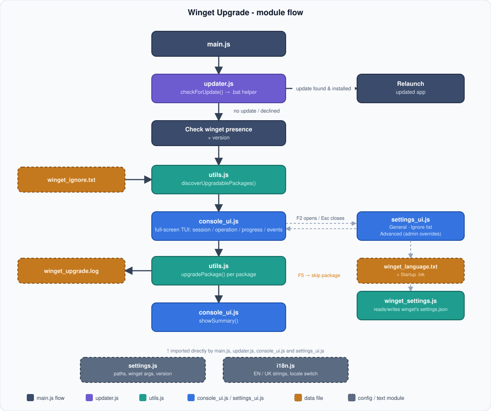

# Winget Upgrade

**[EN](https://github.com/sergeiown/Winget_Upgrade/blob/main/readme.md)** | [UA](https://github.com/sergeiown/Winget_Upgrade/blob/main/readme_ua.md)

Winget Upgrader is a Node.js command line tool that automates the process of updating software on your computer using Windows Package Manager ([Winget](https://learn.microsoft.com/en-us/windows/package-manager/winget/)).

Winget Upgrader uses Winget commands to update all software installed on your computer. It automatically checks for Winget on your system, performs the software updates, and keeps an event log for easy tracking of the process.

```
Windows Package Manager (Winget) is a package management tool for Windows that allows
you to easily install, update and uninstall software directly from the command line.
Winget allows you to update installed programs quickly and conveniently, making it
a useful tool for keeping your system up to date.
```

## Structure



## Functionality

### 1. Checking the availability of Winget
Before starting the update, the program checks whether Winget is installed on the system. If Winget is not installed, the program displays an error message and stops execution, providing instructions on how to install it.

Next, the program checks the version of Winget. If the version of Winget is less than the one required for correct execution of commands, the program displays an error message and provides instructions on how to update Winget to the latest version via the Microsoft Store or the command line.

### 2. Upgrading programs
The Winget Upgrade program uses `winget upgrade` to discover which installed packages currently have an update available, filters out anything on the ignore list, then calls `winget upgrade --id` once per remaining package to update it individually. Upgrade process:
- Automatically accepts the terms of the agreement.
- Disables interactivity, allowing the upgrade process to continue without interruption.
- Distinguishes an actual upgrade from "already up to date" and from a genuine failure, so the final summary is accurate.

### 3. Visual output
The program pauses briefly after each individual check (update check, winget version, ignore-list application) so nothing flies by too fast to read. Once discovery is done, the list of packages that will be updated is printed and the program pauses again before starting. Then, for each package, the console is cleared and a header with the package name and its position (e.g. `[3/42]`) is shown, followed by a colored, live progress bar with an ETA. Once every package has been processed, a colored summary is printed: how many packages were updated, how many were already up to date, and which ones (if any) failed.

### 4. Logging.
The program keeps a log of events in the file `winget_upgrade.log`, which stores information about:
- Actions performed.
- Errors.
- Other events related to the upgrade process.

The log file `winget_upgrade.log` is stored next to the program itself, and is also reachable from the Start Menu group.

### 5. Limiting the size of the log
The log is automatically truncated if its size exceeds 256 KB to avoid file overflow.

### 6. Ignore list
When the program is first launched, it generates a plain text ignore file template `winget_ignore.txt`, listing the packages that should not be updated. Each entry goes on its own line, and it doesn't need to be the exact package identifier - any part of the name or id is enough, matched case-insensitively. Lines starting with `#` are treated as comments. For example:
```
# 7zip
# Google.Chrome
7zip
chrome
```
This matches `7zip.7zip` and both `Google.Chrome` and any other package whose id contains "chrome".

If an older `winget_ignore.json` from a previous version is found, its entries are automatically migrated into `winget_ignore.txt` and the old file is kept as `winget_ignore.json.bak`.

The program logs which packages were ignored, one per line, in both the console and the log file.

### 7. Automatic updates
On every launch, the program checks GitHub for a newer release (with a short animated "Checking for updates..." indicator). If one is found, it asks for confirmation before downloading and silently installing it, then restarts automatically. Declining, or already being on the latest version, simply continues with the regular upgrade process.

## System requirements

| Supported on Windows versions with winget (Windows Package Manager) support: Windows 10 Version 1809 (Build 17763) and later or Windows 11 |                       [](https://en.wikipedia.org/wiki/List_of_Microsoft_Windows_versions)                       |
| :--- | :---: |

## Usage

Download `WingetUpgradeSetup.exe` from the [release](https://github.com/sergeiown/Winget_Upgrade/releases) page and run it:

1. The installer runs for the current user only - no administrator rights are required.
2. During installation you can leave the "Start Winget Upgrade automatically when I sign in" task checked (enabled by default) to have it run at every sign-in, or uncheck it if you'd rather launch it manually.
3. The Start Menu group also includes shortcuts straight to the ignore list (`winget_ignore.txt`) and the log file (`winget_upgrade.log`) for quick access.
4. Once installed, the program can be removed at any time from "Apps & features" ("Programs and Features").

## Error messages

In case of errors, the program displays the corresponding messages in the console and writes them to the log file for further analysis.

## Shutting down the program

When the program is finished updating, it automatically exits to free up system resources.

## License

[Copyright (c) 2024-2026 Serhii I. Myshko](https://github.com/sergeiown/Winget_Upgrade/blob/main/LICENSE)
