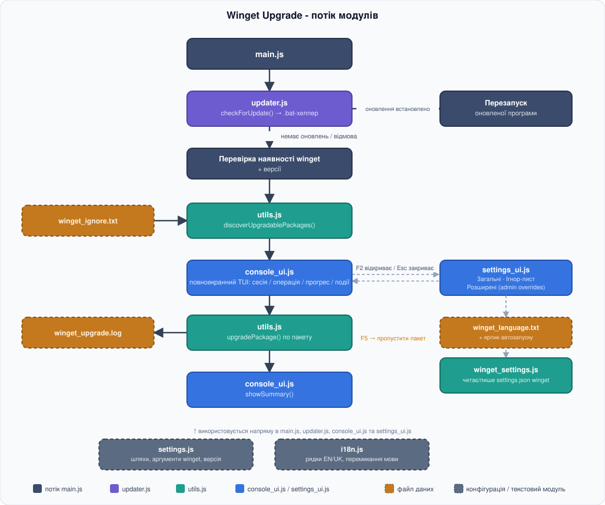

# Winget Upgrade

[EN](https://github.com/sergeiown/Winget_Upgrade/blob/main/readme.md) | **[UA](https://github.com/sergeiown/Winget_Upgrade/blob/main/readme_ua.md)**

Winget Upgrader - це інструмент командного рядка Node.js, який автоматизує процес оновлення програмного забезпечення на комп'ютері за допомогою Windows Package Manager ([Winget](https://learn.microsoft.com/uk-ua/windows/package-manager/winget/)).

Winget Upgrader використовує команди Winget для оновлення всього програмного забезпечення, встановленого на вашому комп'ютері. Він автоматично перевіряє наявність Winget на вашій системі, виконує оновлення програм та веде журнал подій для зручності слідкування за процесом.

```
Windows Package Manager (Winget) - це інструмент управління пакетами для ОС Windows,
який дозволяє легко встановлювати, оновлювати та видаляти програмне забезпечення
безпосередньо з командного рядка. Winget дозволяє швидко та зручно оновлювати
встановлені програми, що робить його корисним інструментом для підтримки вашої
системи в актуальному стані.
```

## Структура



## Функціональні можливості

### 1. Перевірка наявності Winget
Перед початком оновлення програма перевіряє, чи встановлений Winget у системі. Якщо Winget не встановлено, програма виводить повідомлення про помилку та зупиняє виконання, надаючи інструкції з можливих дій для встановлення.

Далі виконується перевірка версії Winget. Якщо версія Winget менша за необхідну для коректного виконання команд, програма виводить відповідне повідомлення про помилку та надає інструкції з оновлення Winget до останньої версії через Microsoft Store або командний рядок.

### 2. Оновлення програм
Програма Winget Upgrade використовує `winget upgrade`, щоб визначити, які встановлені пакети мають доступне оновлення, відфільтровує ті, що в списку ігнорування, а потім викликає `winget upgrade --id` окремо для кожного з пакетів, що лишились. Процес оновлення:
- Автоматично приймає умови угоди.
- Вимикає інтерактивність, що дозволяє продовжити процес оновлення без перерви.
- Розрізняє реальне оновлення, стан "вже актуальна версія" та справжню помилку, тому підсумок наприкінці точний.

### 3. Візуальне оформлення
Після виявлення пакетів виводиться їхній список, і програма робить невелику паузу перед початком оновлення. Далі, перед кожним пакетом екран консолі очищується та показується заголовок з назвою пакета і його номером (наприклад, `[3/42]`), а також кольоровий прогрес-бар з орієнтовним часом завершення (ETA). Після обробки всіх пакетів виводиться кольоровий підсумок: скільки пакетів оновлено, скільки вже були актуальними, і які саме (якщо є) не вдалося оновити.

### 4. Логування
Програма веде журнал подій у файлі `winget_upgrade.log`, де зберігається інформація про:
- Виконані дії.
- Помилки.
- Інші події, пов'язані з процесом оновлення.

Файл журналу `winget_upgrade.log` зберігається поруч із самою програмою, а також доступний через групу в меню Пуск.

### 5. Обмеження розміру журналу
Журнал автоматично обрізається, якщо його розмір перевищує 256 КБ, щоб уникнути переповнення файлу.

### 6. Список ігнорування
При першому запуску програма генерує шаблон текстового ігнор-файлу `winget_ignore.txt`, в якому вказуються пакети, які не потрібно оновлювати. Кожен запис - на новому рядку, і не обов'язково вказувати точний ідентифікатор пакета - достатньо частини назви чи id, збіг перевіряється без урахування регістру. Рядки, що починаються з `#`, вважаються коментарями. Наприклад:
```
# 7zip
# Google.Chrome
7zip
chrome
```
Це відповідатиме `7zip.7zip`, а також `Google.Chrome` і будь-якому іншому пакету, id якого містить "chrome".

Якщо знайдено старий `winget_ignore.json` з попередньої версії, його вміст автоматично переноситься у `winget_ignore.txt`, а старий файл зберігається як `winget_ignore.json.bak`.

Програма виводить інформацію про пакети, що ігноруються, в консоль та журнал, формуючи повідомлення для кожного пакета на новому рядку.

### 7. Автоматичне оновлення
При кожному запуску програма перевіряє наявність новішого релізу на GitHub (з коротким анімованим індикатором "Checking for updates..."). Якщо такий є, вона запитує підтвердження перед завантаженням і тихим встановленням оновлення, після чого автоматично перезапускається. Відмова від оновлення, як і випадок коли вже встановлена остання версія, просто продовжує зі звичайним процесом оновлення програм.

## Вимоги до системи

| Підтримується у версіях Windows з підтримкою winget (Windows Package Manager): Windows 10 версії 1809 (Build 17763) і новіших або Windows 11 |                       [](https://en.wikipedia.org/wiki/List_of_Microsoft_Windows_versions)                       |
| :--- | :---: |

## Використання

Завантажте `WingetUpgradeSetup.exe` зі сторінки [релізів](https://github.com/sergeiown/Winget_Upgrade/releases) і запустіть його:

1. Інсталятор встановлює програму лише для поточного користувача - права адміністратора не потрібні.
2. Під час встановлення можна лишити позначеним завдання "Запускати Winget Upgrade автоматично при вході в систему" (увімкнено за замовчуванням), щоб програма запускалася при кожному вході, або зняти позначку, якщо плануєте запускати вручну.
3. У групі Start Menu також є ярлики прямо до списку ігнорування (`winget_ignore.txt`) і до файлу журналу (`winget_upgrade.log`) для швидкого доступу.
4. Після встановлення програму можна видалити в будь-який момент через "Додатки" ("Програми і компоненти").

## Повідомлення про помилки

У разі виникнення помилок, програма виводить відповідні повідомлення у консоль та записує їх у файл журналу для подальшого аналізу.

## Завершення роботи

Після завершення оновлення програми автоматично виходить, щоб звільнити ресурси системи.

## Вкладені файли

- `main.js`: Головний файл програми.
- `utils.js`: Модуль для виконання команд та ведення журналу подій.
- `settings.js`: Модуль, який містить необхідні налаштування для виконання команд та ведення журналу подій.
- `console_ui.js`: Модуль, що відповідає за кольоровий вивід у консоль, прогрес-бар/ETA та підсумок наприкінці.
- `updater.js`: Модуль, який перевіряє наявність новіших релізів на GitHub і встановлює їх.
- `installer/winget_upgrade.iss`: скрипт Inno Setup для збірки інсталятора.
- `build_installer.bat`: локальний/резервний варіант, що збирає й підписує `winget_upgrade.exe`, після чого компілює й підписує інсталятор.

## Ліцензія

[Copyright (c) 2024-2026 Serhii I. Myshko](https://github.com/sergeiown/Winget_Upgrade/blob/main/LICENSE)
